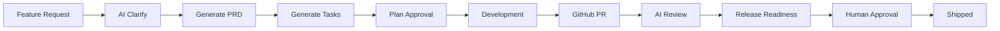

# ShipFlow AI

AI-assisted product delivery platform for the ChaiCode hackathon — from feature request to shipped code.

**Live demo:** https://ai-powered-code-review-web.vercel.app

## What it does

ShipFlow AI runs a full delivery loop:

1. **Discover** — capture feature requests (manual form, **Customer Intake** page, email/ticket/call intake API)
2. **Clarify** — AI asks questions; **user replies auto-trigger the next AI round**; duplicate features are educated and flagged
3. **Plan** — generate PRD → engineering tasks → team approves the plan
4. **Build** — connect GitHub repos, track PRs, link PRs to features
5. **Review** — AI reviews PRs against PRD/tasks (blocking vs non-blocking)
6. **Ship** — release readiness check → human approval gate → shipped

## Tech stack

| Layer | Technology |
|-------|------------|
| Monorepo | Turborepo + pnpm |
| Web | Next.js 16, Shadcn UI |
| API | tRPC (`packages/trpc`) + server actions |
| Auth | BetterAuth (GitHub OAuth + email) |
| Database | Prisma + PostgreSQL (Neon) |
| Jobs | Inngest (clarify, PRD, tasks, AI review, release readiness) |
| GitHub | Octokit App + webhooks |
| AI | Vercel AI SDK + OpenRouter |
| Vectors | Pinecone (optional context) |
| Billing | Razorpay (optional) |

## Project structure

```
my-app/
├── apps/
│   ├── web/          # Next.js dashboard + API routes
│   └── api/          # Express tRPC server (optional)
├── packages/
│   ├── database/     # Prisma schema + client
│   ├── services/     # Domain logic (features, credits, repos)
│   └── trpc/         # tRPC routers
```

## Getting started

### Prerequisites

- Node.js 20+
- pnpm 9+
- PostgreSQL (Neon recommended)
- GitHub OAuth App + GitHub App
- OpenRouter API key (for AI features)
- Inngest dev server (local) or Inngest Cloud (production)

### Install

```bash
cd my-app
pnpm install
```

### Environment

Copy `apps/web/.env.example` to `apps/web/.env` and fill in values. Key variables:

- `DATABASE_URL` / `DIRECT_URL` — Neon pooled + direct URLs
- `BETTER_AUTH_SECRET`, `BETTER_AUTH_URL`
- `GITHUB_CLIENT_ID`, `GITHUB_CLIENT_SECRET` — OAuth sign-in
- `GITHUB_APP_ID`, `GITHUB_APP_PRIVATE_KEY`, `GITHUB_WEBHOOK_SECRET` — repo access
- `OPENROUTER_API_KEY`
- `INNGEST_DEV=1` for local jobs

### Database

```bash
pnpm db:deploy    # apply migrations (production-safe)
pnpm db:generate  # regenerate Prisma client
```

### Run locally

```bash
# Terminal 1 — Next.js
pnpm dev

# Terminal 2 — Inngest dev server
pnpm inngest:dev
```

Open http://localhost:3000 → sign up → connect GitHub App → create a feature request.

## Demo path (for judges)

1. **Sign in** at `/sign-in` (GitHub or email)
2. **Dashboard** `/dashboard` — real stats (repos, PRs, reviews, approvals)
3. **Feature request** `/dashboard/feature-requests` — create with intake source
3b. **Customer intake** `/dashboard/intake` — email / ticket / call demo (auto-starts AI clarify)
4. **Clarify → PRD → Tasks** — run AI actions on feature detail page (tasks via Inngest background job)
5. **Approve plan** when status is "Awaiting Plan Approval"
6. **PRD Editor** `/dashboard/prd` — edit generated PRD
7. **Task board** `/dashboard/tasks` — move tasks between columns
8. **Repositories** `/dashboard/repositories` — connect repos (enforces plan limit)
9. **Pull requests** `/dashboard/pull-requests` — AI review on PRs
10. **Review history** `/dashboard/review-history`
11. **Release approval** `/dashboard/approvals` — human ship gate
12. **Workspaces** `/dashboard/workspaces` — multi-tenant switcher

## Intake API (email / ticket / call)

```bash
curl -X POST https://your-domain/api/intake/feature-request \
  -H "Authorization: Bearer $SHIPFLOW_INTAKE_SECRET" \
  -H "Content-Type: application/json" \
  -d '{
    "workspaceId": "your-workspace-id",
    "title": "Add dark mode",
    "description": "Users want a dark theme toggle in settings",
    "source": "email"
  }'
```

Set `SHIPFLOW_INTAKE_SECRET` in environment.

## GitHub setup

Two separate GitHub integrations:

| Purpose | Type | Callback URL |
|---------|------|--------------|
| User sign-in | OAuth App | `/api/auth/callback/github` |
| Repo access | GitHub App | `/api/github/callback` |

Webhook URL: `https://your-domain/api/github/webhook`

## Architecture



## Deployment (Vercel)

- Root directory: `my-app`
- Build command: `pnpm build` (via turbo)
- Set all env vars from `.env.example`
- Run `pnpm db:deploy` against production database before first deploy
- Register Inngest app with production signing keys

## License

MIT — ChaiCode hackathon submission.
