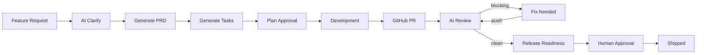

# ShipFlow AI

[](https://github.com/Ayush-Panda-design/AI-powered-Code-review/actions/workflows/ci.yml)

AI-assisted product delivery platform for the ChaiCode hackathon — from feature request to shipped code.

**Live demo:** https://ai-powered-code-review-web.vercel.app

## What it does

ShipFlow AI runs a full delivery loop:

1. **Discover** — capture feature requests (manual form, **Customer Intake** page, email/ticket/call intake API)
2. **Clarify** — AI asks questions; **user replies auto-trigger the next AI round**; duplicate features are educated and flagged
3. **Plan** — generate PRD → engineering tasks → team approves the plan
4. **Build** — connect GitHub repos, track PRs, link PRs to features
5. **Review** — AI reviews PRs against PRD/tasks (blocking vs non-blocking) with inline GitHub comments and **GitHub Checks** status
6. **Ship** — release readiness check → human approval gate → **auto-merge linked PRs** → shipped

## Tech stack

| Layer | Technology |
|-------|------------|
| Monorepo | Turborepo + pnpm |
| Web | Next.js 16, Shadcn UI |
| API | tRPC (`packages/trpc`) + server actions |
| Auth | BetterAuth (GitHub OAuth + email) |
| Database | Prisma + PostgreSQL (Neon) |
| Jobs | Inngest (clarify, PRD, tasks, AI review, release readiness, billing cron) |
| GitHub | Octokit App + webhooks |
| AI | Vercel AI SDK + OpenRouter / Gemini |
| Vectors | Pinecone (optional PR context) |
| Billing | Razorpay monthly subscriptions (optional Pro plan) |

## Project structure

```
my-app/
├── apps/
│   ├── web/          # Next.js dashboard + API routes
│   └── api/          # Express tRPC server (optional OpenAPI docs)
├── packages/
│   ├── database/     # Prisma schema + client
│   ├── services/     # Domain logic (features, credits, repos, billing)
│   └── trpc/         # tRPC routers
```

## Getting started

### Prerequisites

- Node.js 20+
- pnpm 9+
- PostgreSQL (Neon recommended)
- GitHub OAuth App + GitHub App
- OpenRouter API key (for AI features)
- Inngest dev server (local) or Inngest Cloud (production)

### Install

```bash
cd my-app
pnpm install
```

### Environment

Copy `apps/web/.env.example` to `apps/web/.env` and fill in values.

| Variable | Purpose |
|----------|---------|
| `DATABASE_URL` / `DIRECT_URL` | Neon pooled + direct Postgres URLs |
| `BETTER_AUTH_SECRET`, `BETTER_AUTH_URL` | Session auth |
| `GITHUB_CLIENT_ID`, `GITHUB_CLIENT_SECRET` | OAuth sign-in |
| `GITHUB_APP_ID`, `GITHUB_APP_PRIVATE_KEY`, `GITHUB_WEBHOOK_SECRET` | Repo access + webhooks |
| `OPENROUTER_API_KEY` | AI clarify, PRD, tasks, review |
| `GEMINI_API_KEY` | Optional faster codegen |
| `INNGEST_DEV=1` | Local background jobs |
| `INNGEST_EVENT_KEY`, `INNGEST_SIGNING_KEY` | Production Inngest |
| `SHIPFLOW_INTAKE_SECRET` | Bearer token for intake API |
| `RAZORPAY_*` | Optional Pro monthly subscription |
| `RAZORPAY_PLAN_ID` | Optional — reuse existing Razorpay plan |
| `PINECONE_*` | Optional vector context for reviews |

### Database

```bash
pnpm db:deploy    # apply migrations (production-safe)
pnpm db:generate  # regenerate Prisma client
```

### Run locally

```bash
# Terminal 1 — Next.js
pnpm dev

# Terminal 2 — Inngest dev server
pnpm inngest:dev
```

Open http://localhost:3000 → sign up → connect GitHub App → create a feature request.

### Tests

```bash
pnpm test
```

Covers workflow constants, review comment utilities, and API rate limiting.

## Demo path (for judges)

1. **Sign in** at `/sign-in` (GitHub or email)
2. **Dashboard** `/dashboard` — real stats (repos, PRs, reviews, approvals)
3. **Feature request** `/dashboard/feature-requests` — create with intake source
3b. **Customer intake** `/dashboard/intake` — email / ticket / call demo (auto-starts AI clarify)
4. **Clarify → PRD → Tasks** — run AI actions on feature detail page (tasks via Inngest background job)
5. **Approve plan** when status is "Awaiting Plan Approval"
6. **PRD Editor** `/dashboard/prd` — edit generated PRD
7. **Task board** `/dashboard/tasks` — move tasks between columns
8. **Repositories** `/dashboard/repositories` — connect repos (enforces plan limit)
9. **Pull requests** `/dashboard/pull-requests` — AI review on PRs (inline comments + GitHub Check runs)
10. **Review history** `/dashboard/review-history`
11. **Release approval** `/dashboard/approvals` — human ship gate
12. **Shipped** `/dashboard/shipped` — approved features archive
13. **Workspaces** `/dashboard/workspaces` — multi-tenant switcher

## Demo video

Record a 3–5 minute walkthrough following the demo path above and add the link here:

`[Demo video URL — YouTube / Loom]`

## Intake API (email / ticket / call)

```bash
curl -X POST https://your-domain/api/intake/feature-request \
  -H "Authorization: Bearer $SHIPFLOW_INTAKE_SECRET" \
  -H "Content-Type: application/json" \
  -d '{
    "workspaceId": "your-workspace-id",
    "title": "Add dark mode",
    "description": "Users want a dark theme toggle in settings",
    "source": "email"
  }'
```

Validated with Zod; rate-limited to 30 requests/minute per IP.

## GitHub integration setup

Two separate GitHub integrations:

| Purpose | Type | Callback URL |
|---------|------|--------------|
| User sign-in | OAuth App | `/api/auth/callback/github` |
| Repo access | GitHub App | `/api/github/callback` |

Webhook URL: `https://your-domain/api/github/webhook`

**GitHub App permissions required:** `Contents: Read & write` (PR merge on ship), `Pull requests: Read & write`, `Checks: Read & write` (AI review check runs), `Metadata: Read`.

Events handled: `pull_request`, `installation`, `installation_repositories` (auto-removes disconnected repos).

AI reviews post **inline PR comments**, a summary comment/review, and a **GitHub Check** (`ShipFlow AI Review`) with pass/fail based on blocking findings.

On human release approval, linked PRs are **squash-merged** automatically when mergeable.

## Razorpay subscriptions

Pro is billed as a **monthly Razorpay subscription** (not a one-time order):

1. Checkout creates a Razorpay subscription via `/api/razorpay/checkout`
2. Client verifies with `razorpay_subscription_id` + payment signature
3. Webhooks handle `subscription.activated`, `subscription.charged` (renewals), and `subscription.cancelled`
4. Daily Inngest cron downgrades workspaces when `currentPeriodEnd` passes

Register webhook events: `subscription.activated`, `subscription.charged`, `subscription.cancelled`.

## Inngest workflows

| Function | Trigger | Purpose |
|----------|---------|---------|
| `clarify-feature-request` | `shipflow/feature.clarify` | AI requirement clarification |
| `generate-prd` | `shipflow/prd.generate` | Structured PRD from clarified request |
| `generate-tasks` | `shipflow/tasks.generate` | Engineering tasks from approved PRD |
| `review-pull-request` | `github/pr.received` | PRD-aware AI code review |
| `check-release-readiness` | `shipflow/release.readiness` | Pre-ship QA summary |
| `generate-task-code` / `open-task-draft-pr` | task events | Optional AI codegen |
| `check-stale-pull-requests` | cron every 6h | Stale PR nudges |
| `syncGitHubPullRequests` | `github/sync.requested` | Background PR sync |
| `check-expired-subscriptions` | cron daily | Downgrade expired Pro plans |

Progress is visible on feature detail pages and the activity feed.

## AI features implemented

| Feature | Description |
|---------|-------------|
| Clarification agent | Follow-up questions, duplicate detection, repo context |
| PRD generation | Problem, goals, non-goals, user stories, acceptance criteria, edge cases |
| Task breakdown | Kanban-ready engineering tasks from PRD |
| PRD-aware review | Blocking vs non-blocking findings with code suggestions |
| Re-review delta | Compares findings across review rounds |
| Release readiness | Lightweight ship/no-ship assessment |
| Review learning | False-positive rules + muted categories |
| Optional codegen | AI draft PRs per task (Gemini) |

## Database schema (high level)

Prisma models in `packages/database/prisma/schema.prisma`:

- **Auth:** `User`, `Session`, `Account`
- **Multi-tenant:** `Workspace`, `WorkspaceMember`, `WorkspaceInvite`, `Subscription`
- **Delivery:** `Project`, `FeatureRequest`, `ClarificationMessage`, `PRD`, `Task`
- **GitHub:** `GitHubInstallation`, `ConnectedRepository`, `PullRequest`, `SyncRun`
- **Review:** `AIReview`, `ReviewRule`, `ReleaseApproval`, `PlanApproval`
- **Billing:** `RazorpayCheckoutOrder`
- **Audit:** `ActivityEvent`

## Architecture



## Deployment (Vercel)

- Root directory: `my-app`
- Build command: `pnpm build` (via turbo)
- Set all env vars from `.env.example`
- Run `pnpm db:deploy` against production database before first deploy
- Register Inngest app with production signing keys

## License

MIT — ChaiCode hackathon submission.

**Builder Mode On | iPhone Giveaway Hackathon** `#chaicode`
